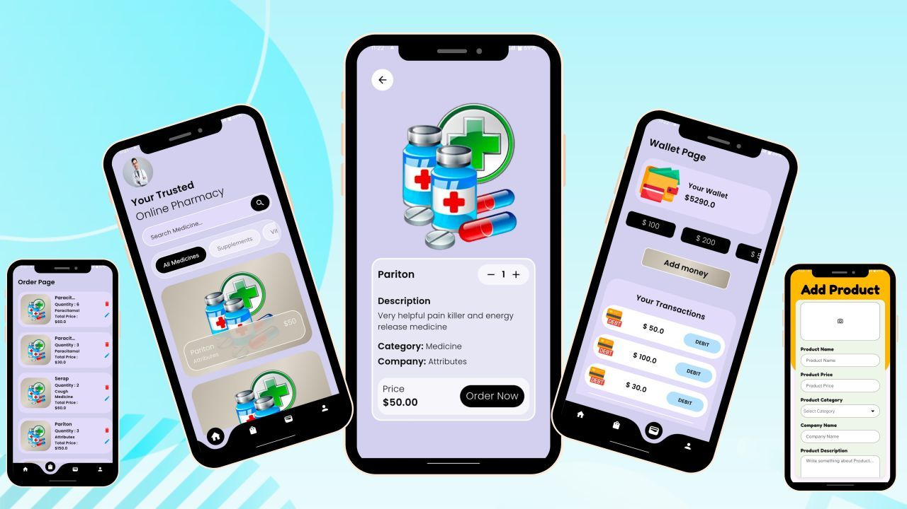
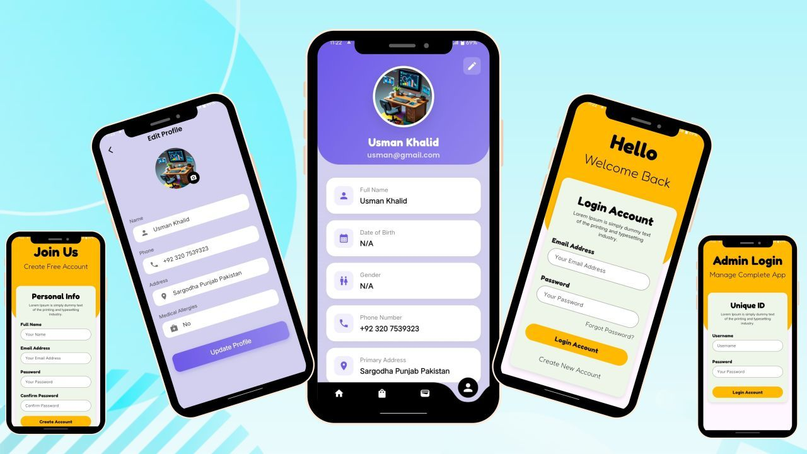

# 💊 MedCare — Medicine Management App

## 📱 About The Project

MedCare is a simple and user-friendly Flutter application designed to help users manage medicines efficiently. The app allows users to add, update, and remove medicines while keeping records organized in a clean and responsive interface.

Firebase Authentication is integrated to provide secure user login and account management, ensuring safe and personalized access to the application.

Built with Flutter, the app delivers a smooth cross-platform experience with fast performance and modern UI design.

---

# 🌟 Features

- 💊 Add Medicines
- ✏️ Update Medicine Records
- ❌ Remove Medicines
- 🔐 Firebase Authentication
- 📱 Clean & Responsive UI
- ⚡ Fast & Smooth Performance

---

# 🛠️ Tech Stack

| Technology | Usage |
|------------|-------|
| Flutter | Frontend Development |
| Firebase | Authentication |
| Dart | Programming Language |
| VS Code | Development Environment |

---

# 📱 Application Screenshots

---

# ⭐ Support

If you like this project, don't forget to star the repository ⭐
